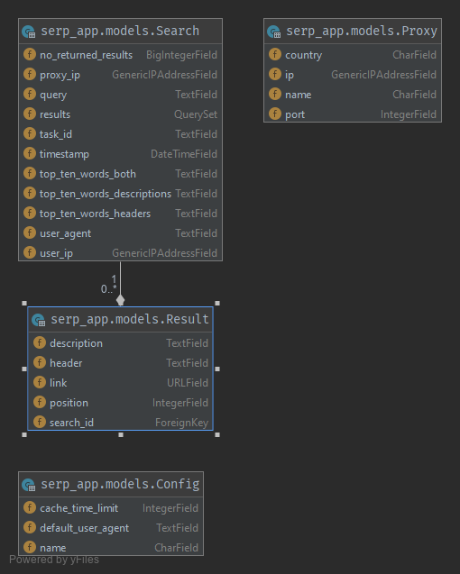

# Appchance SERP recruitment task
**Author:** Mateusz Grabuszyński  
**E-mail:** mgrabuszynski@gmail.com

## How to run
First run:
1. Create volumes `serp_db_data` and `serp_redis_data`
2. Build containers
3. Make migrations
4. Create superuser

It should be something like that:
```
docker volume create serp_db_data
docker volume create serp_redis_data
docker-compose up --build
docker exec -it serp_backend_1 python manage.py makemigrations
docker exec -it serp_backend_1 python manage.py migrate
docker exec -it serp_backend_1 python manage.py createsuperuser
```

Later:
```
docker-compose up
```

## Database schema


## Done
1. Users can give their query in the form.
2. Results are saved in PostgreSQL database: site links with their position, descriptions and headers, number of results returned by Google, word frequency statistics alongside with user's IP address.
3. Results are shown from the cache if not enough time has passed.
4. The time of cache can be configured by adding ONE record to Config table (can be done in Django Admin).

## Not done
1. Dedicated command for bulk queries.

## Explanation and to-do's
* Normally, I should not add `.env` file with `SECRET_KEY` here because of security, but it's more convenient to do it like that right now.
* `no` is often used as an abbreviation of `number_of`, so i.e. `no_results` is `number_of_results`.
* Sometimes there is one or more results missing (i.e. when you type 30, you get 29 results) - that's because some of the additional Google boxes (Youtube, ads...) in search are counted as a result (tweaks would be needed to repair that behaviour).
* If added more than one record into Config, only the first one is gonna be read (may be useful for different users).
* Cancelling the task on waiting screen does not revoke it (should revoke Celery task).
* There's no visual representation of invalid fields in the form (styling).
* Proxy should work, but was not tested in real-case-scenario.
* Tests
